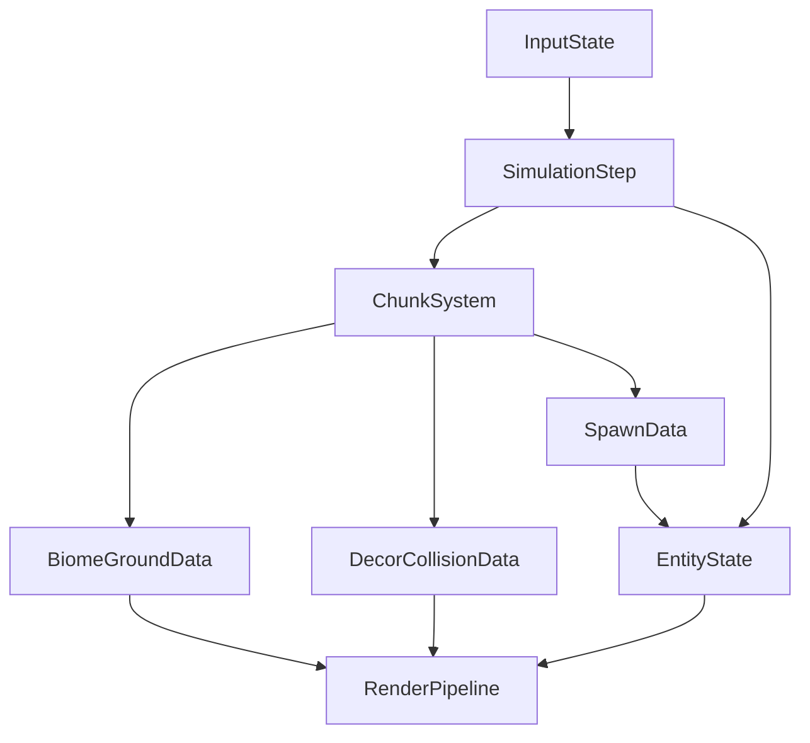

# PaperWorld TODO Implementation Document

This TODO is written so another developer can execute each step with minimal interpretation. It follows [docs/tech-stack.md](docs/tech-stack.md), [docs/world-generation.md](docs/world-generation.md), [docs/biomes.md](docs/biomes.md), and [.cursorrules](.cursorrules).

## Working Rules For Every Step

- Keep architecture order explicit: `input -> simulation -> render`.
- Keep modules plain ES modules under `js/` (no build tools).
- Keep functions short and focused; pass dependencies explicitly.
- Run a quick manual test before marking each step complete.
- Stop after each step for user approval before continuing.

## TODO Steps (Approve Each One)

### Phase 1 - Core Loop and Square Movement

1. **Create project shell**
  - Create `index.html`, `styles.css`, `js/main.js`.
  - Add one full-window canvas and load `js/main.js` as module.
  - Done when: blank canvas renders with no console errors.
  - Test: refresh page and verify canvas fills viewport.
2. **Add main game state object**
  - In `js/main.js`, define central `gameState` with player/camera/time/debug.
  - Add init function to set starting position and constants.
  - Done when: state prints once to console at startup.
  - Test: verify state fields exist and are not `undefined`.
3. **Add fixed timestep loop**
  - Implement RAF loop with accumulator (`update` at fixed dt, `render` each frame).
  - Keep call order `readInput -> simulate -> render`.
  - Done when: loop runs smoothly and dt is stable.
  - Test: show FPS in console every second.
4. **Add keyboard input module**
  - Create `js/input/input-state.js` for WASD + arrows.
  - Expose `createInputState`, `attachInputListeners`, `readMovementAxis`.
  - Done when: key down/up updates input state reliably.
  - Test: print movement axis while keys are held/released.
5. **Add player square entity**
  - Create `js/entities/player.js` with position, size, speed, facing.
  - Add `updatePlayerMovement(player, inputAxis, dt)` and `drawPlayer(ctx, camera, player)`.
  - Done when: red square can be drawn at world coordinates.
  - Test: manually set position and verify expected render location.
6. **Wire movement into simulation**
  - Read input axis each tick and update player position.
  - Keep movement frame-rate independent (`speed * dt`).
  - Done when: square moves equally on slow/fast frame rates.
  - Test: hold key for 2 seconds and verify consistent distance.
7. **Add simple camera follow**
  - Create `js/render/camera.js` with camera centered on player.
  - Convert world coordinates to screen coordinates in render calls.
  - Done when: player stays near screen center while moving.
  - Test: move in all directions; camera tracks correctly.
8. **Add world bounds clamp**
  - Define temporary world rectangle constants.
  - Clamp player position after movement updates.
  - Done when: player cannot move outside boundary.
  - Test: hold movement against each edge and verify stop.
9. **Add debug HUD**
  - Create `js/render/debug-hud.js` showing position, chunk, FPS, biome.
  - Add toggle key (e.g., `F3`).
  - Done when: HUD appears/disappears and values update live.
  - Test: toggle repeatedly while moving.

### Phase 2 - Deterministic Biomes as Solid Colors

1. **Add deterministic random utilities**
  - Create `js/world/hash.js` and `js/world/rng.js`.
    - Implement deterministic hash from `(worldSeed, cx, cy)`.
    - Done when: same input always returns same hash/random sequence.
    - Test: run function multiple times and compare outputs.
2. **Add chunk coordinate helpers**
  - Create `js/world/chunks.js` with `WORLD_CHUNK_SIZE`, key encode/decode, world-to-chunk conversion.
    - Keep chunk record format as plain object.
    - Done when: player position maps to expected chunk ids.
    - Test: verify chunk id changes at exact boundaries.
3. **Define biome IDs and colors**
  - Create `js/world/biome-defs.js` with all 10 documented biome IDs.
    - Add temporary solid color per biome for ground rendering.
    - Done when: all 10 IDs exist and are referenced from one source.
    - Test: script assertion that biome list length is 10.
4. **Implement biome sampling**
  - Create `js/world/biome-noise.js` with deterministic scalar sampler.
    - Add mapping function in `js/world/biome-map.js` from scalar range to biome ID.
    - Done when: same world position always maps to same biome.
    - Test: sample fixed coordinates twice and compare results.
5. **Generate chunk ground biome grid**
  - In `js/world/chunk-generate.js`, build per-chunk ground data using biome sampler.
    - Save chunk records in cache by chunk key.
    - Done when: requesting same chunk returns stable ground biome data.
    - Test: log chunk data hash before/after movement away/back.
6. **Render ground layer (solid colors only)**
  - Create `js/render/layers/ground-layer.js`.
    - Draw visible cells/patches using biome color from chunk data.
    - Done when: map shows large color regions representing biomes.
    - Test: move around and confirm transitions across regions.
7. **Add chunk streaming**
  - Load chunk radius around camera/player each frame.
    - Evict far chunks from cache with max-distance rule.
    - Done when: memory does not grow unbounded during long movement.
    - Test: move far in one direction for 2 minutes and inspect cache size.
8. **Add biome/chunk debug tools**
  - Show current biome ID and chunk coord in HUD.
    - Add optional overlay grid lines for chunk boundaries.
    - Done when: debug info matches visible biome changes.
    - Test: cross a boundary and verify coord increments correctly.

### Phase 3 - Decorations and Collision

1. **Define decoration data model**
  - Create `js/world/decor-defs.js` with `id`, `biomeId`, `blocking`, `footprint`, `shape`, `color`.
    - Include minimal non-blocking and blocking entries for each biome.
    - Done when: each biome has at least 2 non-blocking and 2 blocking defs.
    - Test: validate schema for all decor defs at startup.
2. **Implement decor placement generator**
  - Create `js/world/decor-generate.js`.
    - Pipeline: candidate points from noise -> spacing filter -> instantiate variants.
    - Done when: same chunk seed yields same decor placements.
    - Test: generate same chunk twice and deep-compare decor arrays.
3. **Attach decor to chunk records**
  - Extend chunk generation to include `decorNonBlocking` and `decorBlocking`.
    - Keep records serializable plain objects.
    - Done when: each generated chunk includes both decor arrays.
    - Test: inspect chunk object shape in debug mode.
4. **Implement decor render layers**
  - Add `js/render/layers/decor-nonblocking-layer.js`.
    - Add `js/render/layers/decor-blocking-layer.js`.
    - Ensure render order: ground -> non-blocking -> actors -> blocking.
    - Done when: blocking decor visibly renders in front of player.
    - Test: walk behind a blocking object and verify occlusion.
5. **Implement collision queries**
  - Create `js/sim/collision.js` for footprint intersection checks.
    - Query only blocking decor from nearby chunks.
    - Done when: movement check returns collision/non-collision correctly.
    - Test: run unit-style manual checks with known rectangles.
6. **Integrate player collision response**
  - Prevent movement through blocking footprints.
    - Use axis-separated resolution (X then Y) for simple slide behavior.
    - Done when: player cannot pass through trees/boulders.
    - Test: approach obstacle from multiple angles and verify stop/slide.
7. **Add collision debug overlay**
  - Draw blocking footprints and player hitbox when debug is enabled.
    - Color overlaps differently for easy diagnosis.
    - Done when: collisions can be visually inspected.
    - Test: move into obstacle and verify overlap highlight.

### Phase 4 - Items and Inventory

1. **Define item catalog and world item shape**
  - Create `js/items/item-defs.js` and `js/items/world-items.js`.
    - Add starter items: `herb`, `stone`, `wood`.
    - Done when: item defs include id, name, stackLimit, color/icon marker.
    - Test: startup validation confirms ids are unique.
2. **Spawn collectible items in chunks**
  - Add deterministic item spawn pass during chunk generation.
    - Store item instances with world position and item id.
    - Done when: moving to same chunk reproduces same item locations.
    - Test: unload/reload chunk and compare spawn list.
3. **Implement pickup interaction**
  - Add proximity pickup radius system in `js/sim/item-pickup.js`.
    - Remove item from world only after successful inventory add.
    - Done when: player can collect items by walking near them.
    - Test: fill inventory then verify extra items are not deleted.
4. **Implement inventory state**
  - Create `js/player/inventory.js` with slots, stacks, add/remove APIs.
    - Keep pure helper functions for stack merge logic.
    - Done when: items stack correctly and respect slot limits.
    - Test: add multiple items and verify expected stack outcomes.
5. **Add inventory UI**
  - Create `js/render/ui/inventory-panel.js`.
    - Add toggle key (e.g., `I`) and show slot contents/counts.
    - Done when: panel opens/closes and reflects live inventory state.
    - Test: pick items and confirm UI updates immediately.
6. **Add save/load for basic progress**
  - Save `worldSeed`, player position, and inventory to `localStorage`.
    - Load on startup with validation and clear error messages on bad data.
    - Done when: refresh restores same seed + inventory.
    - Test: collect items, refresh page, verify state persists.

### Phase 5 - Enemy NPCs and Basic Zelda1-Style Combat

1. **Define enemy types and stats**
  - Create `js/entities/enemies/enemy-defs.js`.
    - Add at least one enemy type with hp, speed, aggro range, contact damage.
    - Done when: enemy catalog exists and is consumed from one module.
    - Test: runtime validation of enemy definitions passes.
2. **Implement deterministic enemy spawning**
  - Create `js/entities/enemies/enemy-spawn.js`.
    - Spawn enemies per chunk using seed/chunk hash and spawn rules.
    - Done when: same seed/chunk gives same enemy spawn set.
    - Test: regenerate chunk and compare enemy spawn list.
3. **Add enemy simulation loop**
  - Create `js/entities/enemies/enemy-update.js`.
    - Implement states: idle, wander, chase player.
    - Done when: enemies move and transition states visibly.
    - Test: enter/leave aggro range and verify behavior change.
4. **Add player health and contact damage**
  - Create `js/player/health.js`.
    - Apply periodic damage when enemy overlaps player; include invulnerability window.
    - Done when: contact reduces health but not every frame.
    - Test: stand inside enemy and verify timed damage ticks.
5. **Track player facing direction**
  - Update player state with last non-zero movement direction.
    - Use facing for attack orientation.
    - Done when: facing remains stable when idle.
    - Test: move in each direction, stop, verify facing persists.
6. **Implement melee attack action**
  - Add attack input (e.g., `J`) and cooldown timer.
    - Create short-lived hitbox in front of player based on facing.
    - Done when: attack cannot be spammed during cooldown.
    - Test: mash key and verify attack rate cap.
7. **Apply attack hit detection**
  - Check attack hitbox against enemy hitboxes during active frames.
    - Subtract hp once per attack window per enemy.
    - Done when: enemies lose health when struck in range.
    - Test: attack in/out of range and compare outcomes.
8. **Handle enemy death and drops**
  - Remove enemy at 0 hp.
    - Add simple deterministic drop chance for item pickups.
    - Done when: dead enemies disappear and sometimes drop loot.
    - Test: defeat many enemies and verify drop behavior.
9. **Add combat UI feedback**
  - Create `js/render/ui/combat-hud.js` with hearts/HP and cooldown bar/icon.
    - Optional: flash enemy on hit for clarity.
    - Done when: player can read health and attack readiness at all times.
    - Test: take damage/attack and verify UI sync.

### Phase 6 - Stabilization and Test Checklist

1. **Centralize tunable constants**
  - Create `js/config/game-balance.js`.
    - Move movement speed, collision sizes, damage, cooldown, spawn rates into constants.
    - Done when: gameplay tuning requires changing constants only.
    - Test: change one constant and verify expected gameplay change.
2. **Write step-by-step QA checklist**
  - Create `docs/test-checklist.md` mirroring these 40 steps.
    - Add pass/fail checkboxes and expected outcomes.
    - Done when: tester can follow checklist without reading code.
    - Test: run through at least one full phase using checklist only.
3. **Regression pass and cleanup**
  - Re-test movement, biome streaming, collision, items, inventory, enemies, combat.
    - Refactor only for clarity and small-function compliance (no feature additions).
    - Done when: all previously approved steps still pass after cleanup.
    - Test: execute complete smoke run from new game to first combat win.

## Architecture Flow Reference

