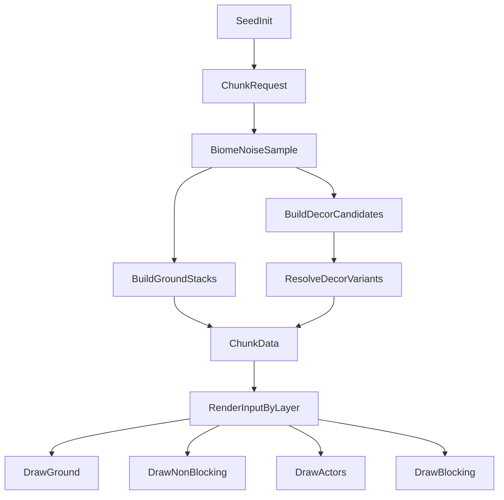

# PaperWorld World Generation

## Purpose

Define how the world is generated from a seed, how papercraft decorative elements are built, and how render layering is enforced.

See stack/tooling decisions in [tech-stack.md](./tech-stack.md).

This document assumes a minimal static stack: plain `html/css/js`, no build step, and direct GitHub Pages hosting.

## Generation Principles

- Deterministic: same world seed -> same world.
- Chunk-local: generate only nearby chunks, cache results.
- Data-first: generation returns world data; rendering is a separate step.
- Biome-driven decoration: biome chooses available motifs, densities, and layering styles.

## World Model

- **World coordinates:** continuous world space for movement.
- **Chunk grid:** fixed-size chunks (for example 32x32 tiles/cells equivalent in world units).
- **Chunk record contains:**
  - Ground layer stacks by cell/patch.
  - Non-blocking decoration placements.
  - Blocking decoration placements.
  - Spawn metadata for NPC placement systems.

## Seed and Noise Strategy

- Global `worldSeed` created at new game start.
- For each chunk `(cx, cy)`, derive `chunkSeed = hash(worldSeed, cx, cy)`.
- Use noise fields with stable frequency values per purpose:
  - **Biome noise:** low frequency, broad regions.
  - **Ground variation noise:** medium frequency for subtle patch variation.
  - **Decor placement noise:** medium/high frequency + thresholding for clustering.
- Use seeded random only after noise selects candidate locations.

## Biome Assignment

- Sample biome noise map at chunk/cell positions.
- Map scalar ranges to biome IDs (for example: grassland, conifer-forest, rocky-highlands).
- See [biomes.md](./biomes.md) for the full biome roster and per-biome definitions.
- Apply blending zone logic near boundaries:
  - Ground textures can blend style weights.
  - Decorative elements remain biome-owned to avoid visual confusion.

## Ground Layer Synthesis

Ground is modeled as stacked papercraft sheets per biome.

Example grassland stack:
1. Dirt/mud base sheet
2. Grass top sheet with irregular edges
3. Clover/detail overlay accents

Rules:
- Each layer has its own color palette, pattern, and edge mask.
- Slight offset/shadow between layers sells depth.
- Ground layers are non-blocking by default.

## Decorative Elements

Two categories:

- **Non-blocking:** flowers, pebbles, small clover clusters, fallen twigs.
- **Blocking:** trees, boulders, dense shrubs, large stumps.

Placement process per chunk:
1. Build candidate points from decor noise thresholds.
2. Filter by biome-specific density and min-spacing rules.
3. Instantiate decor definitions with variant index from seeded RNG.
4. Mark collider footprint only for blocking elements.

## Papercraft Construction Rules

Each decorative element is composed of paper-like parts:

- **Shape layers:** stacked simple geometry (circles, ellipses, cut polygons).
- **Pattern overlays:** small repeating motifs to make pieces feel crafted.
- **Edges:** slightly darker or lighter cut-edge strokes.
- **Shadows:** soft drop shadows per layer with small directional offset.

Conifer example:
- 2-4 dark-green spiky circular canopy layers.
- Brown trunk segment between canopy and ground.
- 1-2 pinecone accents tucked between canopy layers.
- Top-to-bottom slight hue shift to avoid flat color appearance.

## Render Layer Contract

Render order must always be:

1. Ground layer
2. Non-blocking decorative elements
3. Player and NPCs
4. Blocking decorative elements

Notes:
- Blocking decor rendering above actors is intentional for occlusion/foreground feel.
- Collision and render order are separate concerns; collision only uses blocking flags and collider footprints.

## Data Flow

## Minimal Implementation Notes

- Keep modules as plain JavaScript files under `js/`.
- Prefer small functions and explicit parameters for RNG/noise inputs.
- Keep generation outputs serializable plain objects (no framework-specific classes required).
- Avoid introducing engine abstractions unless they solve an immediate concrete problem.

## Initial Biome Content Targets

- **Grassland biome**
  - Ground: dirt -> grass -> clover overlays.
  - Decor non-blocking: flowers, clover clusters.
  - Decor blocking: shrubs, occasional boulders.
- **Conifer biome**
  - Ground: soil -> needles/moss accents.
  - Decor non-blocking: pine needles, cones, small stones.
  - Decor blocking: layered conifer trees, stumps.

## Implementation Sequence

1. Implement seed + chunk scaffolding.
2. Implement biome and ground synthesis.
3. Implement decor placement split (non-blocking vs blocking).
4. Implement startup texture generation for first two biomes.
5. Hook generated chunk data into the plain JS render layer pipeline.
